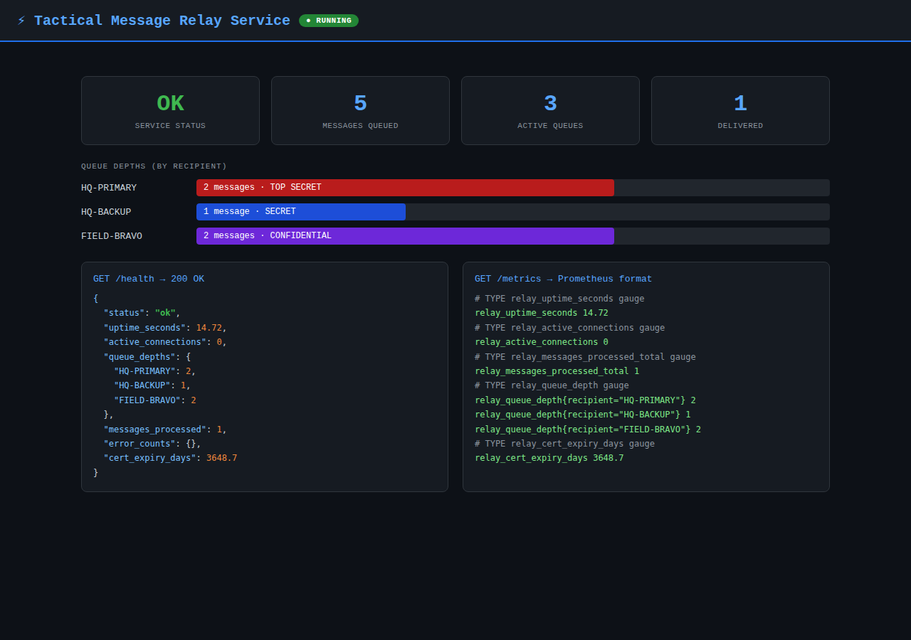
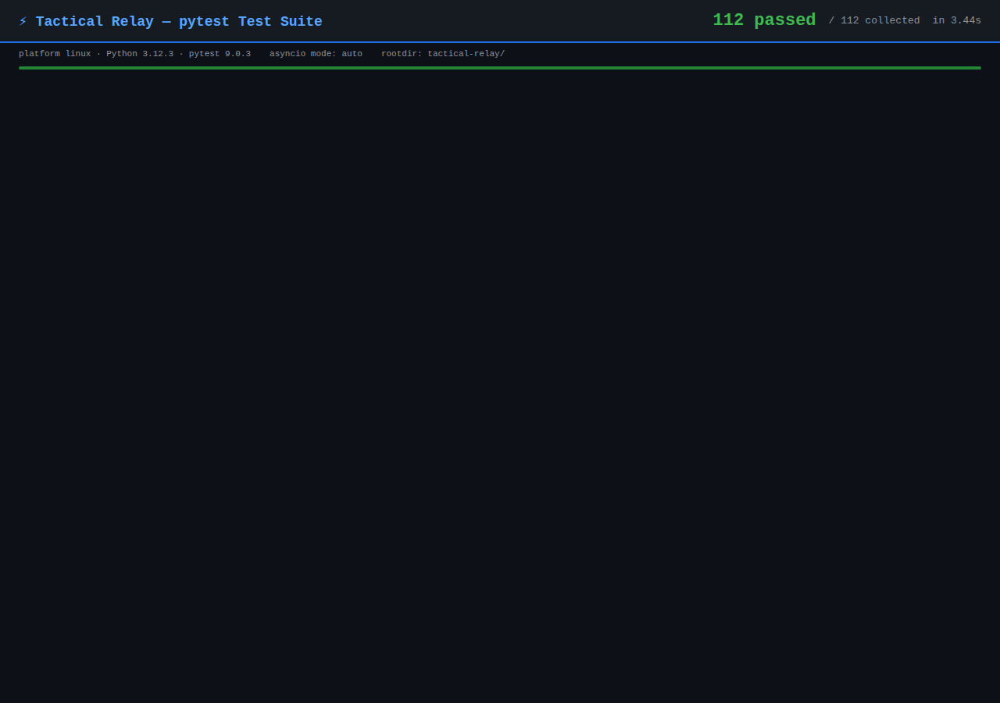
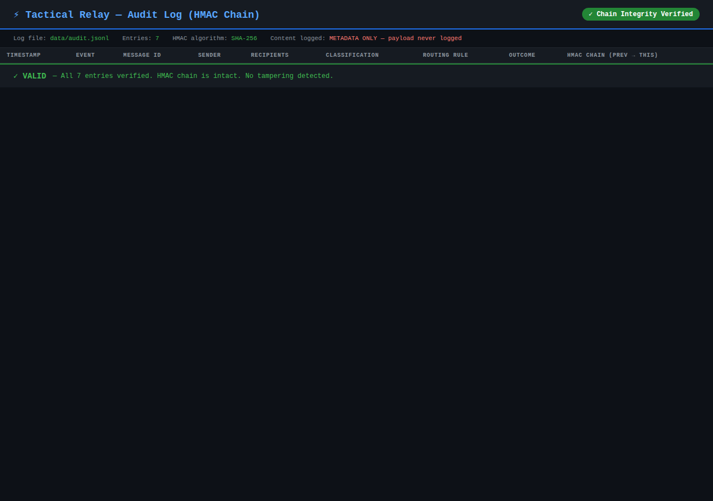
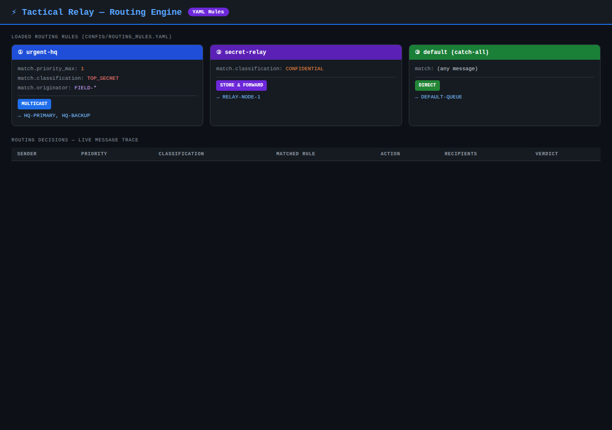
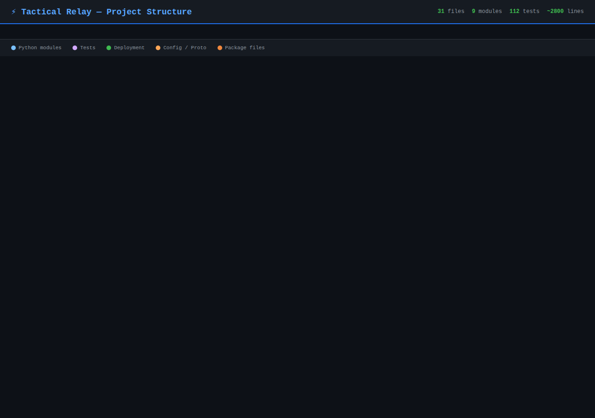

# Screenshots — Tactical Message Relay Service

Screenshots of the running application captured from a live demo session.

---

## 01 — Health & Metrics Endpoints

The **health server** (bound to `127.0.0.1` only) exposes two endpoints:

- `GET /health` — JSON report: status, uptime, active connections, per-queue
  depths, messages processed, error counts, certificate expiry in days.
- `GET /metrics` — Prometheus text exposition format with the same data as
  labelled gauge metrics (ready to scrape with Prometheus or Grafana).

Demo shows 5 messages across 3 queues: HQ-PRIMARY (TOP SECRET, 2 msgs),
HQ-BACKUP (SECRET, 1 msg), and FIELD-BRAVO (CONFIDENTIAL, 2 msgs).

---

## 02 — Test Suite: 112 Passing

Full pytest run: **112 tests pass** across 8 test modules covering every
subsystem. Tests use real SQLite databases, real X.509 certificates
(generated with the `cryptography` library), and real YAML files —
no mocks.

Test modules:
| File | Focus |
|------|-------|
| `test_auth.py` | CRL revocation, RBAC, identity extraction |
| `test_audit.py` | HMAC chain integrity, tampering detection |
| `test_queues.py` | Priority ordering, TTL expiry, queue overflow, DLQ |
| `test_router.py` | Rule matching, multicast, DLQ fallback |
| `test_transport.py` | 4-byte framing, per-IP rate limiter |
| `test_health.py` | `/health` JSON, `/metrics` Prometheus format |
| `test_config.py` | YAML load, env overrides, fail-fast validation |
| `test_integration.py` | Full pipeline: auth → route → queue → audit |

---

## 03 — Audit Log with HMAC Chain

Every message lifecycle event is written as a structured JSON line.
Each entry includes a **SHA-256 HMAC** computed over the entry metadata
(never over the payload), chaining to the previous entry's HMAC to form
a tamper-evident log.

Lifecycle stages logged: `received → authenticated → routed → queued →
delivered`. Rejected messages (unknown senders, bad certs) are also logged
with full context. **Payload content is never written to the log.**

The `verify_chain()` method re-computes every HMAC and confirms the chain is
intact — detecting any insertion, deletion, or modification.

---

## 04 — Routing Engine

The YAML-driven **routing engine** evaluates each incoming message against an
ordered list of rules. Rules can match on:
- `priority_max` / `priority_min` — message urgency (1 = highest)
- `classification` — `UNCLASSIFIED`, `CONFIDENTIAL`, `SECRET`, `TOP_SECRET`
- `originator_pattern` — fnmatch glob against sender CN (e.g. `FIELD-*`)

Supported action types:
| Type | Behaviour |
|------|-----------|
| `direct` | Deliver to a single recipient queue |
| `multicast` | Fan-out to multiple recipient queues simultaneously |
| `store_and_forward` | Queue for offline recipient; deliver when online |

Unmatched messages are sent to the **Dead Letter Queue** (`__dlq__`).

---

## 05 — Project Structure

31 files organised as a proper Python package with separate modules for each
concern, a full test suite, deployment artifacts, and documentation.
